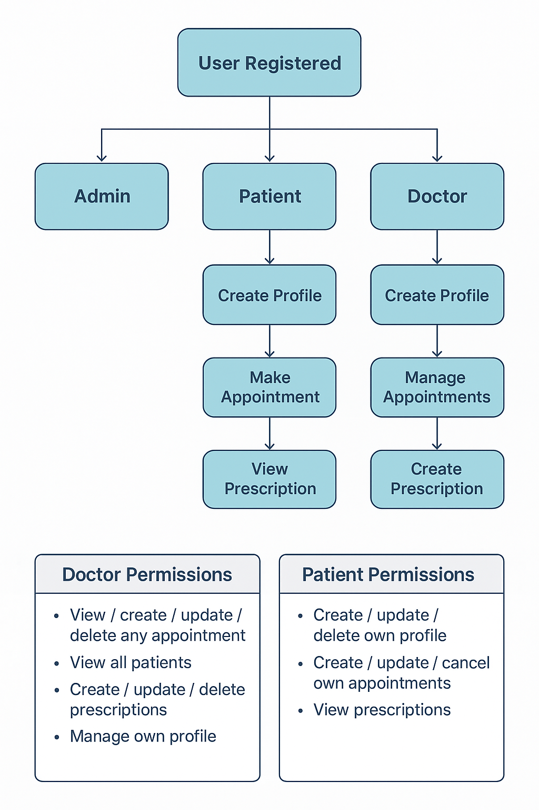

# 📌 Doctor Patient Management API

A professional Django REST Framework project for managing doctors, patients, appointments, and prescriptions — built with JWT authentication, role-based permissions, and full Swagger documentation.

---

## 🚀 Features

### 🔐 Authentication
- JWT login / logout
- Register as **Doctor** or **Patient**
- Role-based permissions
- Secure password hashing

### 🧑‍⚕️ Doctor Module
- Doctor profile (specialty, bio, working hours)
- View assigned appointments
- Approve / cancel appointments
- Create prescriptions
- Filter appointments by status

### 👤 Patient Module
- Patient profile
- Book an appointment with doctors
- View or cancel own appointments
- View prescriptions

### 📅 Appointments
- Patient → Doctor booking system
- Status: Pending, Approved, Cancelled, Completed
- View appointments history

### 💊 Prescriptions
- Attach prescription to an appointment
- View prescriptions as patient

### 📘 Documentation
- Interactive API docs
- Built with **drf-spectacular**
- Visit: `/api/docs/`

---

## 🛠 Tech Stack
- **Backend:** Django 5, Django REST Framework
- **Authentication:** JWT (SimpleJWT)
- **API Docs:** drf-spectacular (Swagger)
- **Filtering:** django-filter
- **Database:** SQLite (default, can be switched to PostgreSQL)
- **Environment:** Python 3.11+

---

## 📂 Project Structure

[Swagger UI PDF](screenshots/api_docs.pdf)